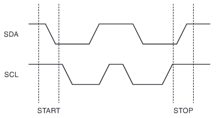

# EEPROM 24C02N

- Two-wire serial interface
- 2K = 32-pages x 8-bytes x 8-bit
- Requires an 8-bit data word address for random word addressing
- 8-byte page write modes

Pin Name |Function          |Notes
---------|------------------|-----
A0 - A2  |Address Inputs    |
SDA      |Serial Data       |Arduino A4
SCL      |Serial Clock Input|Arduino A5
WP       |Write Protect     |Read/Write when connected to GND. When connected to VCC write protection is enabled.
NC       |No Connect        |
GND      |Ground            |
VCC      |Power Supply      |2.7-5.5V

## Device Operation

**CLOCK and DATA TRANSITIONS:** The SDA pin is normally pulled high with an external device. Data on the SDA pin may change only during SCL low time periods. Data changes during SCL high periods will indicate a start or stop condition as defined below.

**START CONDITION:** A high-to-low transition of SDA with SCL high is a start condition must precede any other command.

**STOP CONDITION:** A low-to-high transition of SDA with SCL high is a stop condition. After a read sequence, the stop command will place the EEPROM in standby power mode.

**ACKNOWLEDGE:** All addresses and data words are serially transmitted to and from the EEPROM in 8-bit words. The EEPROM sends a zero to acknowledge that it has received each word. This happens during the ninth clock cycle.

**STANDBY MODE:** The AT24C01A/02/04/08A/16A features a low-power standby mode which is enabled: (a) upon power-up and (b) after the receipt of the STOP bit and the completion of any internal operations.

**MEMORY RESET:** After an interruption in protocol, power loss or system reset, any 2-wire part can be reset by following these steps:

1. Clock up to 9 cycles.
2. Look for SDA high in each cycle while SCL is high.
3. Create a start condition

### Bus Timing

### Write Cycle Timing

### Device Addressing

EEPROM requires an 8-bit device address word following a **start condition** to enable the chip for a read or write operation.

The device address word consists of a mandatory one, zero sequence for the first four most significant bits as shown

The next 3 bits are the A2, A1 and A0 device address bits for the 1K/2K EEPROM. These 3 bits must compare to their corresponding hard-wired input pins.

For example, if all pins (A2, A1, A0) are connected to GND then the address is `10100000` for writing and `10100001` for reading.

The eighth bit of the device address is the read/write operation select bit. A **read** operation is initiated if this bit is high `1` and a **write** operation is initiated if this bit is low `0`.

Upon a comparison of the device address, the EEPROM will output a zero. If a comparison is not made, the chip will return to a standby state.

### Device address using _Wire.h_ library

A2, A1, A0 -> 0-GND, 1-VCC

0 |1 |0 |1 |0 |A2|A1|A0|Address
--|--|--|--|--|--|--|--|---
0 |1 |0 |1 |0 |0 |0 |0 |0x50
0 |1 |0 |1 |0 |0 |0 |1 |0x51
0 |1 |0 |1 |0 |0 |1 |0 |0x52
0 |1 |0 |1 |0 |0 |1 |1 |0x53
0 |1 |0 |1 |0 |1 |0 |0 |0x54
0 |1 |0 |1 |0 |1 |0 |1 |0x55
0 |1 |0 |1 |0 |1 |1 |0 |0x56
0 |1 |0 |1 |0 |1 |1 |1 |0x57

### BYTE WRITE

A write operation requires an 8-bit data word address following the device address word and acknowledgment. Upon receipt of this address, the EEPROM will again respond with a zero and then clock in the first 8-bit data word. Following receipt of the 8-bit data word, the EEPROM will output a zero and the addressing device, such as a microcontroller, must terminate the write sequence with a stop condition. At this time the EEPROM enters an internally timed write cycle, $t_WR$, to the nonvolatile memory. All inputs are disabled during this write cycle and the EEPROM will not respond until the write is complete.

### PAGE WRITE

The 1K/2K EEPROM is capable of an 8-byte page write.

A page write is initiated the same as a byte write, but the microcontroller does not send a stop condition after the first data word is clocked in. Instead, after the EEPROM acknowledges receipt of the first data word, the microcontroller can transmit up to seven (1K/2K) data words. The EEPROM will respond with a zero after each data word received. The microcontroller must terminate the page write sequence with a stop condition.

The data word address lower three (1K/2K) bits are internally incremented following the receipt of each data word. The higher data word address bits are not incremented, retaining the memory page row location. When the word address, internally generated, reaches the page boundary, the following byte is placed at the beginning of the same page. If more than eight (1K/2K) data words are transmitted to the EEPROM, the data word address will “roll over” and previous data will be overwritten.

### ACKNOWLEDGE POLLING

Once the internally timed write cycle has started and the EEPROM inputs are disabled, acknowledge polling can be initiated. This involves sending a start condition followed by the device address word. The read/write bit is representative of the operation desired. Only if the internal write cycle has been completed will the EEPROM respond with a zero allowing the read or write sequence to continue.

## Links

- [Ben Eaten Youtube video about reading EEPROM](https://www.youtube.com/watch?v=a6EWIh2D1NQ) youtube
- [Two-wire Serial EEPROM AT24C02 Datasheet](doc/datasheet_24c02n.pdf) pdf
- [Arduino EEPROM - 24C04 | 24C08 | 24C16 | 24C32 | 24C64 (No Libraries)](https://www.youtube.com/watch?v=WZ5GESc6424) youtube
- [AT24C04 EEPROM Programming using Arduino](https://www.youtube.com/watch?v=urfhXmCd-uA) youtube
